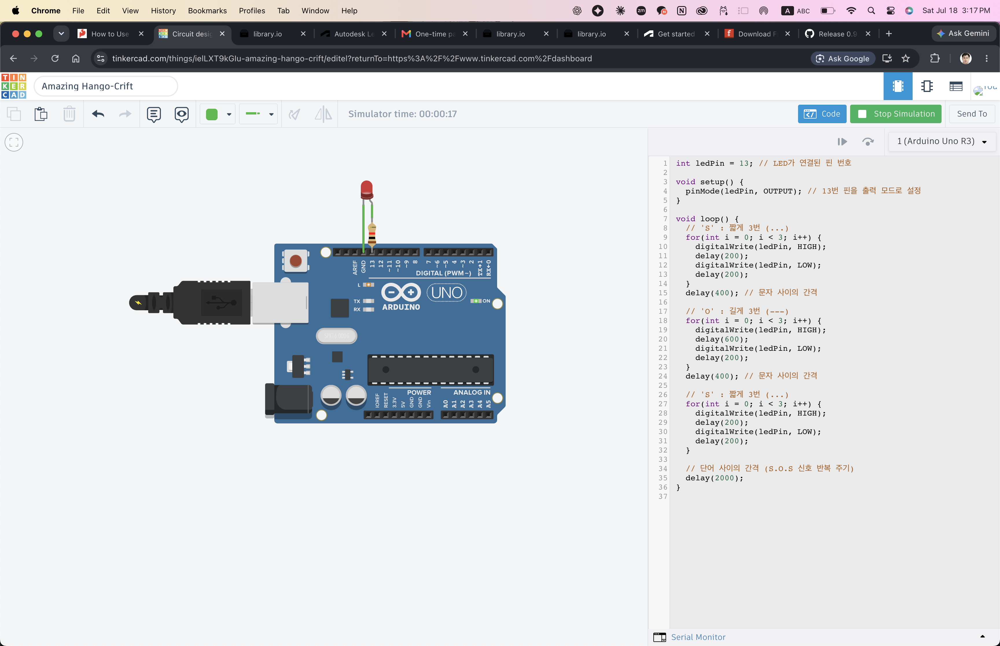

# (문제2) 아두이노 GPIO + LED 예제

## 1. 아두이노 GPIO 핀 제어 기본 (GPIO Basics)
*Write your explanation of what GPIO is and how to use `pinMode()` and `digitalWrite()` commands here.*

### **What is GPIO?**

**GPIO** stands for **General Purpose Input/Output**. It refers to the physical pins lined up along the edges of the Arduino board. They are "general purpose" because their behavior isn't permanently fixed at the factory—you get to program them to do exactly what you want.

You can configure them to act as:

* **Inputs:** To "read" or "listen" to electrical signals coming in from the outside world (like reading a temperature sensor or checking if a button is pressed).
* **Outputs:** To "write" or "send" electrical signals out to control other components (like spinning a motor or turning on an LED).

Since you are controlling an LED for this project, you will be using a GPIO pin purely as an **Output**.

---

### **How to use the `pinMode()` command**

Before you can use a GPIO pin, you have to formally declare what its job will be. The `pinMode()` function acts like a job assignment. You typically put this command inside the `void setup()` block so the Arduino knows the pin's job as soon as it boots up.

* **Syntax:** `pinMode(pin_number, MODE);`
* **How it works:** You give it the number of the pin you are wiring up, and tell it whether it should be an `INPUT` or an `OUTPUT`.
* **Example:** `pinMode(13, OUTPUT);`
*(This tells the Arduino: "Hey, prepare pin 13 to push electricity out.")*

---

### **How to use the `digitalWrite()` command**

Once a pin has been assigned as an `OUTPUT` using `pinMode()`, you use `digitalWrite()` to actually turn the electricity on or off. Because it is a "digital" command, it only understands two absolute states: `HIGH` (maximum voltage, usually 5V) or `LOW` (zero voltage, 0V).

* **Syntax:** `digitalWrite(pin_number, STATE);`
* **How it works:** You give it the pin number you want to control, and tell it whether to push voltage (`HIGH`) or cut the voltage (`LOW`).
* **Example (Turn On):** `digitalWrite(13, HIGH);`
*(This sends 5 Volts out of pin 13, which provides the power to light up the LED).*
* **Example (Turn Off):** `digitalWrite(13, LOW);`
*(This drops the voltage at pin 13 down to 0 Volts, which shuts the LED off).*

## 2. 모스 부호 S.O.S 신호 생성 알고리즘 및 소스 코드 (Algorithm & Source Code)


*Write your explanation of your Morse Code timing algorithm here (e.g., short/long blinks).*
*Provide the C++ code using `for` loops inside the `void loop()` function, and explain how the infinite loop works.*

```cpp
int ledPin = 13; // Pin number the LED is connected to

void setup() {
  pinMode(ledPin, OUTPUT); // Set pin 13 to output mode
}

void loop() {
  // 'S' : 3 short blinks (...)
  for(int i = 0; i < 3; i++) {
    digitalWrite(ledPin, HIGH);
    delay(200);
    digitalWrite(ledPin, LOW);
    delay(200);
  }
  delay(400); // Gap between letters

  // 'O' : 3 long blinks (---)
  for(int i = 0; i < 3; i++) {
    digitalWrite(ledPin, HIGH);
    delay(600);
    digitalWrite(ledPin, LOW);
    delay(200);
  }
  delay(400); // Gap between letters

  // 'S' : 3 short blinks (...)
  for(int i = 0; i < 3; i++) {
    digitalWrite(ledPin, HIGH);
    delay(200);
    digitalWrite(ledPin, LOW);
    delay(200);
  }

  // Gap between words (S.O.S signal repeat cycle)
  delay(2000); 
}

```


## 3. 무한 반복 신호 출력 실행 (S.O.S Execution)

*(Used Tinkercad for the simulation due to hardware constraints!)*

## 4. 추가 수행목표 답변 (Additional Explanations)
* **소비전력 계산 (Power Consumption Calculation):** *Write your calculation for multiple NeoPixels here (e.g., 60mA per NeoPixel).*
* **전원 어댑터 선택 (Power Adapter Selection):** *Write your conclusion on what Amperage (A) 5V DC adapter is needed based on your calculation above.*