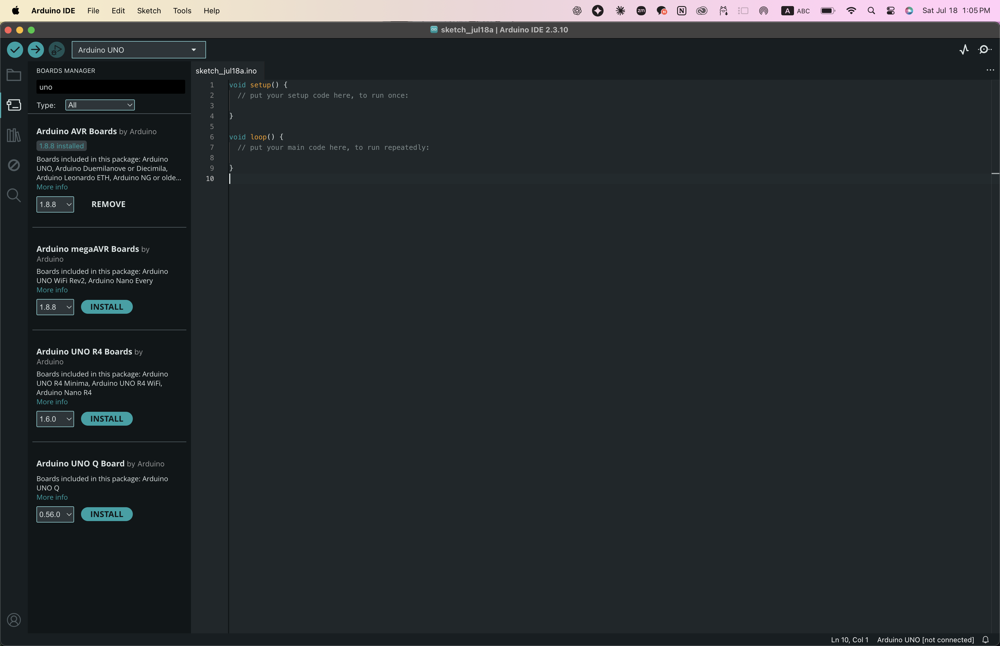
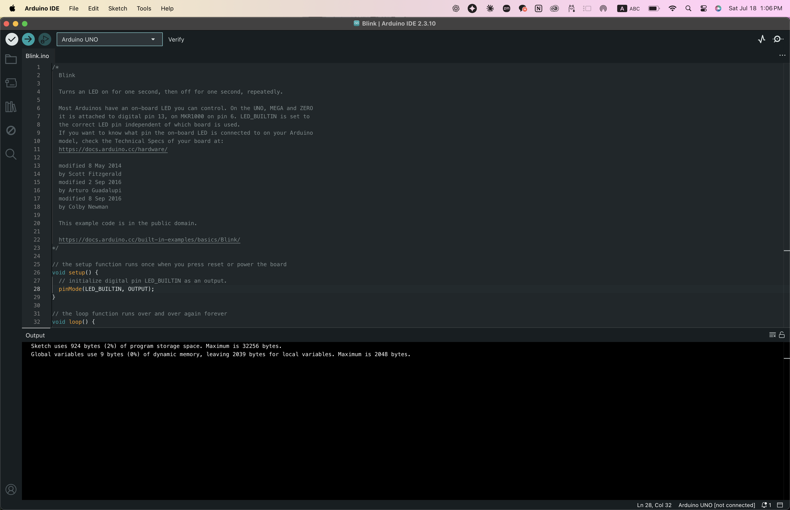
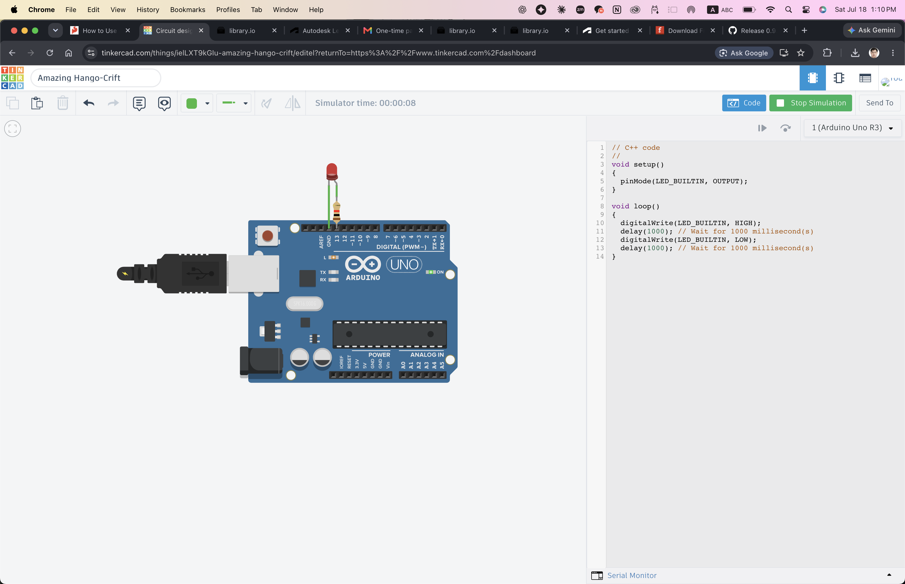

# (문제1) 아두이노 개발환경 구축하기

## 1. 아두이노 IDE 설치 및 설정 완료 (Installation & Setup)


1. To install the Arduino IDE, go to this website: [Arduino Software](https://www.arduino.cc/en/software/#ide) page. After entering the website, click download. Find the package that fits your OS. After downloading, the installer will do everything it needs. Open the new app after it installs. (I use a MacBook, so I had to allow the installer to install unknown apps.)

## 2. 샘플 소스코드 컴파일 (Compiling Code)

1. To start a new project, click on the tab labeled File. Then, click on the sub-label "New Sketch". Choose your board. 
2. Plug your board and a notification will pop up asking to use a port. Choose that port. The computer needs to know exactly which USB connection is sending data to the Arduino
3. Write your code, and then click verify. This will ensure your code is compilable. Then click upload. This will upload the code into the arduino board's Flash, which would create its new firmware. 


## 3. LED 깜박임 프로그램 실행 (LED Blink Execution)

*(used Tinkercad for the simulation due to hardware constraints!)*
1. You can add libraries by going into Tools/Libraries. You can pick any library you want. These libraries are prebuilt code used for the Arduino, made by other people. You can install libraries, build your own, or use existing libraries within the IDE. 

```cpp
#include <Arduino_BuiltIn.h>
```

### Explanation of the code: 

```md
In C and C++, any line that starts with a # (like #include or #define) is a command for the C Preprocessor.

When you write `#include <Arduino_BuiltIn.h>`, the preprocessor acts like a giant, automated keyboard shortcut.

Before the compiler looks at your code, the preprocessor finds the file named Arduino_BuiltIn.h, opens it, copies every single line of text inside it, and pastes it directly into your file right where you wrote #include.

It is a literal text substitution. It doesn't load a module into memory or create an object like Python does; it just creates one massive text file for the compiler to read.
```

2. To make sure that your port is communicating well with the Arduino, you can use a `Serial Monitor`. A Serial Monitor acts like a terminal that only reads the output of the arduino as a separate data-bus. After the uploading your code, for example:

```cpp
int counter = 0; // Create a variable to hold our number

void setup() {
  // Initialize serial communication at 9600 bits per second:
  Serial.begin(9600);
  
  // Print a starting message (runs only once)
  Serial.println("Starting the loop...");
}

void loop() {
  // Print the text without moving to a new line
  Serial.print("Current Count: ");
  
  // Print the actual number, then move to a new line
  Serial.println(counter);
  
  // Add 1 to the counter
  counter++; 
  
  // Pause the program for 1000 milliseconds (1 second)
  delay(1000);
}
```
The serial monitor will begin transmitting the output. 

```cpp
void setup() {
  // Initialize serial communication at 9600 bits per second:
  Serial.begin(9600);
  
  // Print a starting message (runs only once)
  Serial.println("Starting the loop...");
}
```
### Void Setup

What does `void setup()` actually mean?
Let's break it down word by word:

void (The Return Type): In programming, when a function finishes doing its job, it usually "returns" a piece of data back to the system (like a math function returning the number 4). The word void literally means "nothing." It tells the Arduino: "This function is just going to execute some commands, but it will not hand any data back to you when it finishes."

* setup (The Name): This is just the assigned name of the function.

* () (The Parameters): Parentheses are where you would normally hand specific data into a function for it to use. Because they are empty, it means this function doesn't need any outside information to do its job.

`So, void setup() translates to: "Run a block of code named 'setup' that requires zero inputs and hands back zero data when it finishes."`

Under the hood, Arduino is programmed in C++. In standard C++, every single program in the world must start with a master function called main(). If there is no main(), the computer has no idea where to start reading the code.

When you look at your Arduino sketch, you don't see a main() function. That is because the Arduino software hides it from you. Behind the scenes, before your code is compiled and sent to the board, the Arduino software secretly wraps your code in a hidden file that looks exactly like this:


```cpp
int main() {
  init();    // A hidden function that turns on the Arduino's internal hardware
  
  setup();   // YOUR setup function! It is called exactly once.
  
  for (;;) { // A standard C++ way to say "loop forever"
    loop();  // YOUR loop function! It runs over and over.
  }
  
  return 0;
}
```

### Baud (Data Transmission, Seconds per Bit)

This is the most important part of the serial monitor. The Serial monitor must be initialized with a command to the built in component called `Serial.begin(9600)`. This opens the serial port and sets the data transmission rate (baud rate) to 9600 bits per second. The Arduino and your computer's Serial Monitor must be set to the exact same baud rate to understand each other, otherwise, you will just see random gibberish characters on your screen. This is because there is no innate clockspeed that both computers have, so they have to blindly agree on the speed. When there is a mismatch, say when the computer is reading too fast, having a baud rate of `115200`, and the bits are being read too frequently, the resulting bits will be gibberish. Too slow, and the bits would be misaligned. This is called sampling rate. When you compile and upload, the uploaded code stays on the Arduino, so if you put `9600` as the baud rate, you must choose `9600` on your computer's read rate. 

### ASCII Explanation

Computers translate binary data (1s and 0s) into readable text using a standardized code called ASCII, where every specific 8-bit chunk corresponds to a letter or symbol.

Because the mismatched timing caused the computer to slice the incoming 1s and 0s at the completely wrong intervals, it creates randomized 8-bit chunks. When the computer tries to faithfully translate those broken chunks back into English letters, the result is random characters. 

### The Rest of the Code:

* **`void loop()`**
This is the heart of the Arduino program. Once `setup()` finishes, the code inside `loop()` runs continuously, from top to bottom, over and over again forever (or until you pull the plug).
* **`Serial.print(...)`**
This sends text or data to the Serial Monitor, but it keeps the cursor on the exact same line. Anything printed immediately after this will be stitched directly next to it.
* **`Serial.println(...)`**
This stands for "Print Line." It sends the text/data to the Serial Monitor, but adds an invisible "carriage return" at the end. This forces the next piece of data to show up on a brand new line.
* **`delay(1000)`**
This pauses the entire Arduino system for a specific amount of time, measured in milliseconds. Since there are 1000 milliseconds in a second, `delay(1000)` stops the code for exactly 1 second before allowing the loop to start over at the top. Without this delay, the Arduino would blast thousands of numbers into your Serial Monitor every second and crash it!

3. If you click save, on the Macbook it saves it on a file named Arduino. Then it saves it as a `.txt` and a `.ino` file.

4. There are no preferences in Macbook, just default settings in each tab. 
