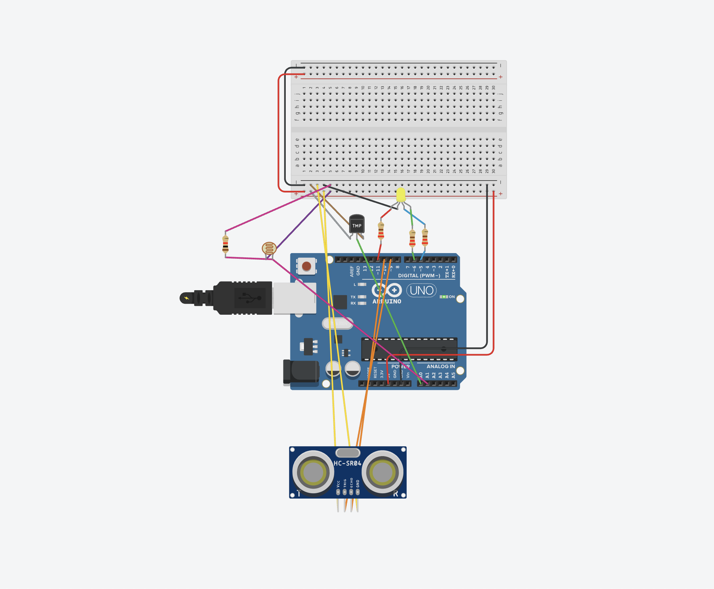
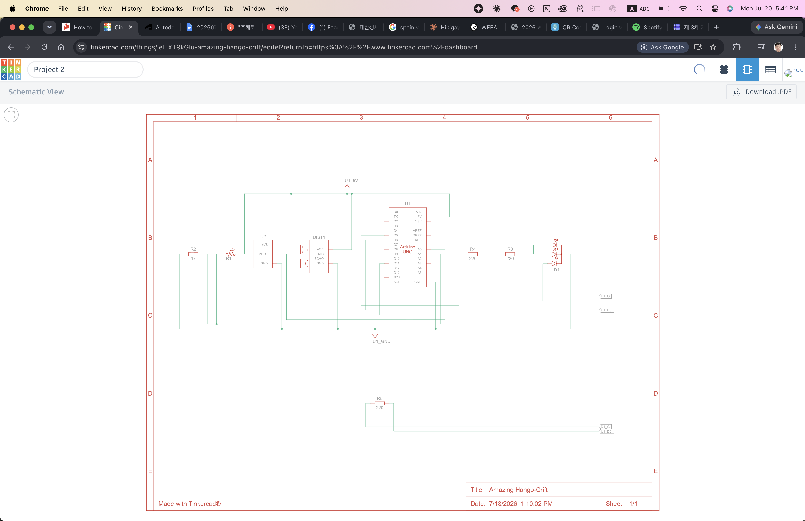

# (Problem 3) Arduino Sensor Data Reading, Processing, and LED Control

## 1. Sensor Connection Methods and Pin Configuration

*(Configured the circuit using the Tinkercad simulator due to hardware port constraints.)*

*   **Temperature Sensor (TMP36):** Uses an analog pin. Connect Power (5V) and GND, then connect the data pin (Vout) to the Arduino's `A0` pin.
*   **Photoresistor (Light Sensor):** Resistance changes based on the amount of light. Connect one leg to 5V, and the other leg to the Arduino's `A1` pin along with a 10kΩ pull-down resistor to read the value using a voltage divider circuit.
*   **Distance Sensor (Ultrasonic HC-SR04):** Uses 2 digital pins. After connecting VCC and GND, connect the Trigger (Trig) pin to pin `9` and the Echo pin to pin `10`.
*   **RGB LED:** Must be connected to pins capable of PWM (Pulse Width Modulation) output to control color and brightness. Connect Red to pin `11`, Green to pin `5`, and Blue to pin `6` along with their respective resistors.

## 2. Sensor Error Filtering Method
Erratic values (noise) can occur due to the physical limitations of the sensors or external interference. To filter these out, we can use a **Moving Average Filter** technique. 
By storing multiple sensor readings in an array and using their average, we can smooth out temporary noise, increasing accuracy and response stability. Additionally, we apply exception handling using conditional statements (`if`) to ignore absurdly out-of-range values (e.g., when the ultrasonic sensor measures a distance of 0 or less).

## 3. Sensor Data Processing and LED Control Algorithm Source Code

**Algorithm Design:**
1.  **Light Sensor:** Turns on the LED when the surroundings get dark (value drops). Turns it off when bright.
2.  **Distance Sensor:** Increases the brightness of the red LED to warn when an object gets closer (distance shortens).
3.  **Temperature Sensor:** Turns on the blue LED to provide a visual alert when the temperature rises above a specific threshold.

```cpp
// Pin Configuration
const int tempPin = A0;
const int lightPin = A1;
const int trigPin = 9;
const int echoPin = 10;
const int ledR = 11;
const int ledG = 5;
const int ledB = 6;

void setup() {
  Serial.begin(9600);
  pinMode(trigPin, OUTPUT);
  pinMode(echoPin, INPUT);
  pinMode(ledR, OUTPUT);
  pinMode(ledG, OUTPUT);
  pinMode(ledB, OUTPUT);
}

void loop() {
  // 1. Read Light Sensor
  int lightVal = analogRead(lightPin);
  
  // 2. Read Temperature Sensor (Convert to Celsius)
  int tempReading = analogRead(tempPin);
  float voltage = tempReading * 5.0 / 1024.0;
  float temperatureC = (voltage - 0.5) * 100;

  // 3. Read Ultrasonic Distance Sensor (includes micro-delays to prevent errors)
  digitalWrite(trigPin, LOW);
  delayMicroseconds(2);
  digitalWrite(trigPin, HIGH);
  delayMicroseconds(10);
  digitalWrite(trigPin, LOW);
  long duration = pulseIn(echoPin, HIGH);
  long distance = duration * 0.034 / 2; // Convert to cm

  // Error Filtering: Ignore abnormal distance values
  if(distance <= 0 || distance > 400) {
    distance = 400; 
  }

  // Integrated LED Control Logic
  if (lightVal < 300) { // Operate LED only when it's dark
    
    // Adjust Red LED brightness based on distance (closer = brighter)
    int redBrightness = map(distance, 5, 50, 255, 0); 
    redBrightness = constrain(redBrightness, 0, 255);
    analogWrite(ledR, redBrightness);

    // Turn on Blue LED based on temperature (when over 25°C)
    if (temperatureC > 25.0) {
      analogWrite(ledB, 255);
    } else {
      analogWrite(ledB, 0);
    }
    
  } else {
    // Turn off all LEDs when it is bright
    analogWrite(ledR, 0);
    analogWrite(ledG, 0);
    analogWrite(ledB, 0);
  }

  delay(100); // Delay for resource limits and response time control
}

```

## 4. Integrated Program Execution Result


*Summary of Operating Principle:* As the `loop()` function repeats, it reads values from each sensor. The first conditional statement checks the light sensor to distinguish between day and night. If it determines the surroundings are dark, it executes nested conditional statements and the `map()` function to gradually adjust the brightness of the red LED via PWM based on the distance to the target (brighter as it gets closer), and turns on the blue LED if the ambient temperature exceeds 25°C.

